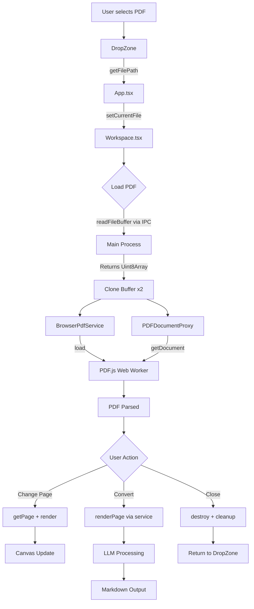

# PDF Processing Architecture

This document provides comprehensive documentation for the PDF processing system in PDF Translator, covering best practices, implementation details, and known issues.

## Table of Contents

1. [Part 1: Best Practices for PDF Processing](#part-1-best-practices-for-pdf-processing)
2. [Part 2: Current Implementation Analysis](#part-2-current-implementation-analysis)
3. [Part 3: Architecture Diagrams](#part-3-architecture-diagrams)
4. [Part 4: Known Issues and Solutions](#part-4-known-issues-and-solutions)

---

## Part 1: Best Practices for PDF Processing

### PDF.js Usage Patterns and Pitfalls

PDF.js is the industry-standard library for PDF rendering in web applications. Based on current best practices (2025-2026):

#### Web Worker Configuration

PDF.js uses Web Workers to offload CPU-intensive parsing operations. Proper worker initialization is critical:

```typescript
// CORRECT: Configure worker source before any PDF operations
import * as pdfjsLib from 'pdfjs-dist'
import workerUrl from 'pdfjs-dist/build/pdf.worker.min.mjs?url'

pdfjsLib.GlobalWorkerOptions.workerSrc = workerUrl
```

**Key Points:**

- Worker source must be configured before calling `getDocument()`
- Using `?url` import with Vite ensures correct bundling
- The worker runs in a separate thread, preventing UI blocking

#### ArrayBuffer Handling

ArrayBuffers have a critical limitation: they can become **detached** when transferred to a Web Worker.

```typescript
// WRONG: Same buffer used twice
const buffer = await readFile()
service1.load(buffer) // ArrayBuffer transferred to worker
service2.load(buffer) // ERROR: buffer is now detached!

// CORRECT: Clone buffers before use
const buffer = await readFile()
const buffer1 = buffer.slice(0) // Create independent copy
const buffer2 = buffer.slice(0) // Create another copy
service1.load(buffer1)
service2.load(buffer2)
```

**Why this happens:**

- When PDF.js transfers an ArrayBuffer to the Web Worker, ownership transfers with it
- The original ArrayBuffer becomes "neutered" (byteLength = 0)
- Any subsequent access throws an error

#### Memory Management for Large PDFs

For documents exceeding 10-50 pages:

1. **Lazy rendering**: Only render visible pages
2. **Canvas cleanup**: Explicitly clear canvas memory when switching pages
3. **Document destruction**: Always call `pdfDoc.destroy()` when done
4. **Page cleanup**: Release page objects after use

```typescript
// Good memory management pattern
const page = await pdfDoc.getPage(pageNum)
try {
  await renderPage(page)
} finally {
  page.cleanup() // Release page resources
}
```

### Cross-Environment Considerations

#### Browser vs Node.js Differences

| Aspect       | Browser                  | Node.js                           |
| ------------ | ------------------------ | --------------------------------- |
| Canvas API   | Native HTMLCanvasElement | @napi-rs/canvas (native binding)  |
| Worker       | Native Web Worker        | Fake worker (same process)        |
| PDF.js build | `pdfjs-dist`             | `pdfjs-dist/legacy/build/pdf.mjs` |
| Font loading | Browser font stack       | Explicit standard_fonts path      |

#### Electron-Specific Concerns

- **Renderer process**: Use browser implementation (has canvas access)
- **Main process**: Cannot render (no canvas), only metadata operations
- **Preload script**: Bridge for secure IPC communication

### Common Failure Modes

| Failure Mode         | Cause                                  | Prevention                            |
| -------------------- | -------------------------------------- | ------------------------------------- |
| Worker not found     | Missing workerSrc configuration        | Configure before any imports          |
| Detached ArrayBuffer | Buffer transferred to worker           | Clone with `.slice(0)`                |
| Canvas context null  | Canvas not in DOM or too large         | Check dimensions, use OffscreenCanvas |
| Memory exhaustion    | Too many pages rendered simultaneously | Implement pagination, cleanup         |
| CORS errors          | Loading PDF from different origin      | Use file:// or configure CORS         |

### References

- [PDF.js GitHub Discussions: Using pdfjs in a web worker](https://github.com/mozilla/pdf.js/discussions/17276)
- [JavaScript PDF libraries guide 2025](https://www.nutrient.io/blog/javascript-pdf-libraries/)
- [Advanced Electron.js Architecture](https://blog.logrocket.com/advanced-electron-js-architecture/)
- [React PDF viewer state management](https://www.nutrient.io/blog/how-to-build-a-reactjs-pdf-viewer-with-react-pdf/)
- [Building High-Performance Electron Apps](https://www.johnnyle.io/read/electron-performance)

---

## Part 2: Current Implementation Analysis

### 1. State Machine: PDF Loading States

The PDF loading process follows this state flow:

```
idle --> loading --> loaded --> error
  ^                    |
  |                    v
  +--- (onClose) <--- destroyed
```

**State Transitions in Workspace.tsx:**

| State     | Trigger         | Next State            |
| --------- | --------------- | --------------------- |
| `idle`    | Component mount | `loading`             |
| `loading` | `init()` starts | -                     |
| `loading` | Success         | `loaded`              |
| `loading` | Error           | `error`               |
| `loaded`  | Page change     | Render (same state)   |
| `loaded`  | Close button    | `destroyed` (unmount) |
| `error`   | Retry button    | `loading`             |

**Key State Variables:**

```typescript
const [isLoading, setIsLoading] = useState(true) // loading state
const [pdfService, setPdfService] = useState(null) // null = not loaded
const [pdfDoc, setPdfDoc] = useState(null) // PDF.js document
const [renderError, setRenderError] = useState(null) // page render errors
const [isRendering, setIsRendering] = useState(false) // page render loading
```

### 2. Component Hierarchy and Data Flow

```
App.tsx
|
+-- currentFile state (string | null)
|
+-- DropZone.tsx
|     |
|     +-- onFileSelect(filePath) --> sets currentFile
|
+-- Workspace.tsx (when currentFile is set)
      |
      +-- filePath prop (from currentFile)
      +-- pdfService (BrowserPdfService instance)
      +-- pdfDoc (PDFDocumentProxy for canvas rendering)
      +-- metadata (page count, title, etc.)
```

**Data Flow Sequence:**

1. **File Selection (DropZone)**:
   ```typescript
   // User drops file or clicks to browse
   const filePath = window.electronAPI.getFilePath(files[0])
   onFileSelect(filePath) // Calls App's handler
   ```

2. **State Update (App)**:
   ```typescript
   const handleFileSelect = (filePath: string) => {
     setCurrentFile(filePath) // Triggers Workspace render
   }
   ```

3. **PDF Loading (Workspace)**:
   ```typescript
   // Effect runs when filePath changes
   useEffect(() => {
     const buffer = await window.electronAPI.readFileBuffer(filePath)

     // Clone buffers (critical for avoiding detachment)
     const serviceBuffer = buffer.slice(0)
     const viewerBuffer = buffer.slice(0)

     // Create service for operations
     const service = new BrowserPdfService()
     await service.load(serviceBuffer)

     // Create doc for canvas rendering
     const doc = await pdfjsLib.getDocument({ data: viewerBuffer }).promise

     setPdfService(service)
     setPdfDoc(doc)
   }, [filePath])
   ```

### 3. PDF Service Abstraction

The PDF service provides a unified interface for both browser and Node.js environments.

**Interface (types.ts):**

```typescript
interface PdfService {
  // Lifecycle
  load(data: Uint8Array): Promise<void>
  destroy(): void

  // Metadata
  getPageCount(): number
  getMetadata(): Promise<PdfMetadata>
  getOutline(): Promise<OutlineItem[] | null>

  // Rendering
  renderPage(pageNum: number, options?: RenderOptions): Promise<string>
  cropImage(base64Image: string, options: CropOptions): Promise<string>

  // Text extraction
  getPageText(pageNum: number): Promise<string>

  // Page manipulation
  extractPageRange(startPage: number, endPage: number): Promise<Uint8Array>

  // Optional: Vector graphics
  detectVectorRegions?(pageNum: number): Promise<VectorRegion[]>
  renderRegion?(pageNum: number, region: VectorRegion, scale?: number): Promise<string>
}
```

**Browser Implementation (browser.ts):**

| Method               | Implementation                                |
| -------------------- | --------------------------------------------- |
| `load()`             | `pdfjsLib.getDocument({ data })`              |
| `renderPage()`       | Create canvas, `page.render()`, return base64 |
| `cropImage()`        | Load image, draw to smaller canvas            |
| `extractPageRange()` | pdf-lib: copy pages to new document           |
| `getPageText()`      | `page.getTextContent()`                       |

**Node Implementation (node.ts):**

| Method         | Implementation                            |
| -------------- | ----------------------------------------- |
| `load()`       | `getDocument()` with custom CanvasFactory |
| `renderPage()` | @napi-rs/canvas for native rendering      |
| `cropImage()`  | @napi-rs/canvas `loadImage()` + draw      |
| Worker config  | Points to legacy build in node_modules    |

**Factory Pattern (index.ts):**

```typescript
export async function createPdfService(
  data: Uint8Array,
  environment: 'browser' | 'node',
): Promise<PdfService> {
  if (environment === 'node') {
    const { NodePdfService } = await import('./node')
    const service = new NodePdfService()
    await service.load(data)
    return service
  } else {
    const { BrowserPdfService } = await import('./browser')
    const service = new BrowserPdfService()
    await service.load(data)
    return service
  }
}
```

### 4. Buffer Handling: The ArrayBuffer Detachment Fix

**The Problem:**

When loading a PDF, we need the buffer for two purposes:

1. BrowserPdfService (for operations like renderPage, extractPageRange)
2. PDFDocumentProxy (for canvas rendering in the viewer)

Both use PDF.js internally, which transfers the ArrayBuffer to a Web Worker. Once transferred, the buffer becomes "detached" and cannot be used again.

**The Fix (Workspace.tsx lines 58-76):**

```typescript
// Read file using Electron IPC
const buffer = await window.electronAPI.readFileBuffer(filePath)

// Clone buffers to avoid detachment issues
// (ArrayBuffer becomes detached after transfer to Web Worker)
const serviceBuffer = buffer.slice(0)
const viewerBuffer = buffer.slice(0)

// Create PDF service (uses first clone)
const service = new BrowserPdfService()
await service.load(serviceBuffer)

// Also load raw pdfjs doc for canvas rendering (uses second clone)
const loadingTask = pdfjsLib.getDocument({ data: viewerBuffer })
const doc = await loadingTask.promise
```

**Why `.slice(0)` works:**

- Creates a new ArrayBuffer with a copy of the data
- Each clone can be independently transferred to workers
- Original buffer remains usable (though we don't use it)

### 5. Worker Initialization: Centralized Pattern (init.ts)

**The Problem:**

PDF.js requires `GlobalWorkerOptions.workerSrc` to be set before any `getDocument()` call. If multiple modules import pdfjs-dist independently, initialization order becomes unpredictable.

**The Solution:**

Create a dedicated initialization module that must be imported first:

```typescript
// src/lib/pdf-service/init.ts
import * as pdfjsLib from 'pdfjs-dist'
import workerUrl from 'pdfjs-dist/build/pdf.worker.min.mjs?url'

// Configure worker source globally
pdfjsLib.GlobalWorkerOptions.workerSrc = workerUrl

// Re-export for convenience
export { pdfjsLib }
```

**Entry Point (main.tsx):**

```typescript
// Initialize PDF.js worker BEFORE any other imports
import './lib/pdf-service/init'

import { StrictMode } from 'react'
import { createRoot } from 'react-dom/client'
// ... rest of imports
```

**Usage in components:**

```typescript
// Import from init module (worker already configured)
import { pdfjsLib } from '../lib/pdf-service/init'

// Now safe to use
const doc = await pdfjsLib.getDocument({ data }).promise
```

### 6. Error Handling: Propagation and Display

**Error Handling Flow:**

```
PDF Loading Error
      |
      v
  catch block in useEffect
      |
      +-> console.error('Failed to load PDF:', error)
      +-> isLoading = false (loading state ends)
      +-> Component shows empty state

Page Render Error
      |
      v
  catch block in renderPage effect
      |
      +-> Check if RenderingCancelledException (ignore)
      +-> console.error('Page render error', err)
      +-> setRenderError(errorMessage)
      +-> UI shows error panel with retry button
```

**Error States in Workspace:**

1. **Load Error**: Silent failure, component shows loading indicator indefinitely (could be improved)

2. **Render Error**: Displayed in UI with retry option
   ```tsx
   {
     renderError && (
       <div data-testid="pdf-render-error">
         <AlertCircle />
         <p>Render Error</p>
         <p>{renderError}</p>
         <button onClick={handleRetryRender}>Retry</button>
       </div>
     )
   }
   ```

3. **Conversion Error**: Appended to markdown output
   ```typescript
   } catch (error) {
     setMarkdown(prev => prev + '\n\n**Error during conversion.**')
   }
   ```

**Retry Mechanism:**

```typescript
const [renderKey, setRenderKey] = useState(0)

const handleRetryRender = () => {
  setRenderError(null)
  setRenderKey(prev => prev + 1) // Triggers useEffect re-run
}

useEffect(() => {
  // renderKey in dependency array forces re-render
}, [pdfDoc, currentPage, showOutline, renderKey])
```

---

## Part 3: Architecture Diagrams

### Component Relationships

```
+------------------------------------------------------------------+
|                         Electron App                              |
+------------------------------------------------------------------+
|                                                                   |
|  +------------------------+    +------------------------------+   |
|  |     Main Process       |    |      Renderer Process        |   |
|  |      (electron/)       |    |         (src/)               |   |
|  +------------------------+    +------------------------------+   |
|  |                        |    |                              |   |
|  |  main.ts               |    |  main.tsx                    |   |
|  |  - Window management   |    |  - React entry point         |   |
|  |  - IPC handlers        |    |  - PDF.js worker init        |   |
|  |  - File system access  |    |                              |   |
|  |                        |    |  App.tsx                     |   |
|  |  preload.ts            |    |  - File selection state      |   |
|  |  - contextBridge       |    |  - Route: DropZone/Workspace |   |
|  |  - Secure IPC expose   |    |                              |   |
|  |                        |    |  DropZone.tsx                |   |
|  +------------------------+    |  - Drag & drop               |   |
|           |                    |  - File input                |   |
|           |                    |                              |   |
|           | IPC                |  Workspace.tsx               |   |
|           |                    |  - PDF viewer (canvas)       |   |
|           v                    |  - Conversion controls       |   |
|  +------------------------+    |  - Markdown output           |   |
|  |    window.electronAPI   |    |                              |   |
|  +------------------------+    +------------------------------+   |
|                                         |                         |
|                                         v                         |
|                          +------------------------------+         |
|                          |     PDF Service Layer        |         |
|                          |    (src/lib/pdf-service/)    |         |
|                          +------------------------------+         |
|                          | - BrowserPdfService          |         |
|                          | - NodePdfService             |         |
|                          | - vector-detector            |         |
|                          +------------------------------+         |
+-------------------------------------------------------------------+
```

### Data Flow: File to Canvas

```
User Action                 DropZone              App               Workspace
    |                          |                   |                    |
    |   Drop PDF file          |                   |                    |
    +------------------------->|                   |                    |
    |                          |                   |                    |
    |          window.electronAPI.getFilePath(file)                    |
    |          +---------------------------------------------------+   |
    |          |                                                   |   |
    |          |     onFileSelect(filePath)        |                    |
    |                          +------------------>|                    |
    |                          |                   |                    |
    |                          |   setCurrentFile(filePath)            |
    |                          |                   +------------------>|
    |                          |                   |                    |
    |                          |                   |    useEffect runs |
    |                          |                   |         |         |
    |                          |                   |         v         |
    |          window.electronAPI.readFileBuffer(filePath)             |
    |          <---------------------------------------------------+   |
    |                          |                   |                    |
    |                    (Returns Uint8Array via IPC)                  |
    |          +---------------------------------------------------+   |
    |                          |                   |                    |
    |                          |                   |  buffer.slice(0)  |
    |                          |                   |  buffer.slice(0)  |
    |                          |                   |         |         |
    |                          |                   |         v         |
    |                          |                   |  BrowserPdfService|
    |                          |                   |     .load()       |
    |                          |                   |         |         |
    |                          |                   |         v         |
    |                          |                   |  pdfjsLib         |
    |                          |                   |  .getDocument()   |
    |                          |                   |         |         |
    |                          |                   |         v         |
    |                          |                   |  setPdfService()  |
    |                          |                   |  setPdfDoc()      |
    |                          |                   |         |         |
    |                          |                   |         v         |
    |                          |                   |  Render effect    |
    |                          |                   |  triggers         |
    |                          |                   |         |         |
    |                          |                   |         v         |
    |                          |                   |  pdfDoc.getPage() |
    |                          |                   |  page.render()    |
    |                          |                   |         |         |
    |                          |                   |         v         |
    |                          |                   |  Canvas displays  |
    |                          |                   |  PDF page         |
```

### IPC Boundaries

```
+----------------------------+        +----------------------------+
|       Main Process         |        |     Renderer Process       |
|       (Node.js)            |        |     (Chromium)             |
+----------------------------+        +----------------------------+
|                            |        |                            |
|  ipcMain.handle(           |  IPC   |  window.electronAPI.       |
|    'read-file-buffer',     |<-------|    readFileBuffer(path)    |
|    (event, path) => {      |        |                            |
|      return fs.readFile..  |------->|  Returns: Uint8Array       |
|    }                       |        |                            |
|  )                         |        |                            |
|                            |        |                            |
|  ipcMain.handle(           |  IPC   |  window.electronAPI.       |
|    'save-markdown-file',   |<-------|    saveMarkdownFile(md)    |
|    (event, content) => {   |        |                            |
|      dialog.showSaveDialog |        |                            |
|      fs.writeFile...       |------->|  Returns: boolean          |
|    }                       |        |                            |
|  )                         |        |                            |
|                            |        |                            |
|  ipcMain.handle(           |  IPC   |  window.electronAPI.       |
|    'get-api-key',          |<-------|    getApiKey()             |
|    () => {                 |        |                            |
|      safeStorage.decrypt   |------->|  Returns: string | null    |
|    }                       |        |                            |
|  )                         |        |                            |
+----------------------------+        +----------------------------+

Security Configuration (main.ts):
- nodeIntegration: false
- contextIsolation: true
- Preload script provides safe API exposure
```

### Mermaid Diagram: PDF Processing Flow



---

## Part 4: Known Issues and Solutions

### 1. ArrayBuffer Detachment Bug

**Symptom:**

```
TypeError: Cannot perform Construct on a detached ArrayBuffer
```

**Cause:**
When `pdfjsLib.getDocument({ data })` is called, the ArrayBuffer is transferred to the Web Worker for parsing. This makes the original buffer unusable.

**The Fix:**
Clone the buffer before each use:

```typescript
// Before (broken):
const buffer = await readFile()
service.load(buffer)
doc = await pdfjsLib.getDocument({ data: buffer }).promise // ERROR!

// After (fixed):
const buffer = await readFile()
const serviceBuffer = buffer.slice(0) // Clone for service
const viewerBuffer = buffer.slice(0) // Clone for viewer
service.load(serviceBuffer)
doc = await pdfjsLib.getDocument({ data: viewerBuffer }).promise
```

**Location:** `/Users/dim/working/apps/pdf-translator/.worktrees/bugfixes-pipeline-redesign/src/components/Workspace.tsx` (lines 58-76)

### 2. React StrictMode Considerations

**Issue:**
React StrictMode in development double-invokes effects, which can cause:

- Multiple PDF loads
- Race conditions with async operations
- Memory leaks if cleanup isn't proper

**Mitigations in Workspace.tsx:**

1. **Cleanup function in useEffect:**
   ```typescript
   return () => {
     pdfService?.destroy()
   }
   ```

2. **Cancellation tracking for render:**
   ```typescript
   let cancelled = false
   let renderTask = null

   // ... async work ...

   return () => {
     cancelled = true
     renderTask?.cancel()
   }
   ```

3. **Ignore cancelled operations:**
   ```typescript
   if (!cancelled) {
     setIsRendering(false)
   }
   ```

**Note:** The current implementation has a subtle issue - the cleanup function references `pdfService` from the closure, which is always `null` on first render. This works because the effect is synchronous enough, but could be improved with a ref.

### 3. Memory Cleanup Patterns

**Pattern 1: Document Destruction**

```typescript
// Workspace.tsx cleanup
return () => {
  pdfService?.destroy() // Calls pdfDoc.destroy() internally
}
```

**Pattern 2: Render Task Cancellation**

```typescript
let renderTask: pdfjsLib.RenderTask | null = null

// Start render
renderTask = page.render({ canvasContext, viewport, canvas })
await renderTask.promise

// Cleanup on page change
return () => {
  if (renderTask) {
    renderTask.cancel() // Prevents "stale" renders
  }
}
```

**Pattern 3: RenderingCancelledException Handling**

```typescript
try {
  await renderTask.promise
} catch (err) {
  if (err instanceof Error && err.name === 'RenderingCancelledException') {
    return // Expected when navigating away, don't report as error
  }
  // Handle actual errors
}
```

### 4. Canvas Context Issues

**Problem:** `canvas.getContext('2d')` can return null if:

- Canvas has 0 dimensions
- Canvas is too large (browser limits)
- WebGL context already acquired

**Current Handling:**

```typescript
const context = canvas.getContext('2d')
if (!context) {
  throw new Error('Could not get canvas context')
}
```

**Potential Improvement:**

- Check canvas dimensions before render
- Use OffscreenCanvas for off-screen rendering
- Implement fallback rendering strategy

### 5. Effect.ts Scoped Resource Management

The codebase includes Effect.ts integration for reliable resource management:

```typescript
// index.ts - Scoped PdfService creation
export const makePdfServiceScoped = (
  data: Uint8Array,
  environment: PdfServiceEnvironment,
): Effect.Effect<PdfService, PdfServiceError, Scope.Scope> =>
  Effect.acquireRelease(
    Effect.tryPromise({
      try: () => createPdfService(data, environment),
      catch: error =>
        new PdfServiceError({
          message: `Failed to create PdfService for ${environment}`,
          cause: error,
        }),
    }),
    service => Effect.sync(() => service.destroy()),
  )
```

**Benefits:**

- Automatic cleanup when scope closes
- Error handling with typed errors
- Composable with other Effect operations

**Usage:**

```typescript
const program = Effect.scoped(
  Effect.gen(function*() {
    const pdf = yield* makePdfServiceScoped(data, 'node')
    // pdf.destroy() called automatically when scope closes
    return pdf.getPageCount()
  }),
)
```

---

## Summary

The PDF processing system in PDF Translator is built on these key principles:

1. **Centralized Initialization**: PDF.js worker configured once in `init.ts`, imported first in `main.tsx`

2. **Buffer Cloning**: Critical fix for ArrayBuffer detachment when using multiple PDF.js instances

3. **Environment Abstraction**: Unified `PdfService` interface works in both browser (Electron renderer) and Node.js (tests)

4. **Proper Cleanup**: Effect hooks with cancellation and destruction to prevent memory leaks

5. **Error Boundaries**: Render errors displayed with retry option, conversion errors appended to output

6. **Security**: IPC bridge with validated handlers, no direct Node.js access from renderer
